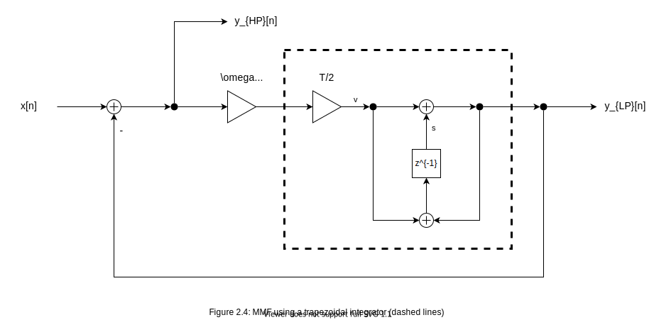
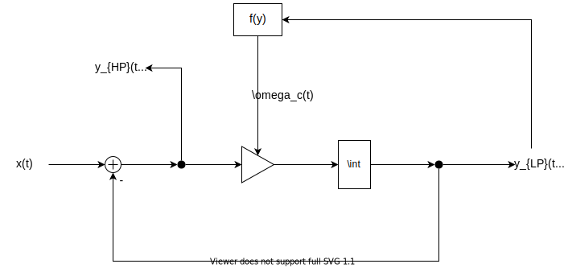

# VirtualAnalogInductors: Nonlinear Inductor Models for Music DSP

## 1. Introduction

Magnetic core inductors [match impedance, balance signals, and more](https://mynewmicrophone.com/what-are-microphone-transformers-and-what-is-their-role/) in analog signal chains. As a side effect, high amplitude signals saturate cores with magnetic flux and drop inductances -- this nonlinearity ***colors*** the sound. The following project explores this phenomenon via first order ***RL*** filters. Real time virtual analog filters in [SOUL](soul.dev) apply the discretized models.

## 2. Review of Linear RL Circuits

*Figure 2.1: RL LPF circuit*  

*(2.1) LPF transfer function*

*Figure 2.2: RL HPF circuit*

*(2.2) HPF transfer function*

An RL ***LPF*** is defined by its impedances (Fig. 2.1). The transfer function follows from voltage division (2.1). Switching the resistor and inductor positions (Fig. 2.2) yields an ***HPF*** (2.2). Both ***cutoffs*** depend on L.

*(2.3) LPF differential equation*

*(2.4) HPF differential equation*

*Figure 2.3: MMF block diagram*

Assuming ***causality and linearity***, the ***inverse Laplace transform of (2.1)*** yields (2.3). Cutoff is inside the integral because it varies with time. Notice that (2.2) is simply the derivative (multiplication by s) of (2.1) divided by the cutoff. Therefore, the ***MMF*** (Fig. 2.3) is simply the LPF **DE** with the HPF defined at the appropriate node. For the remaining models, we will model the LPF with the location of the HPF being implied.

## 3 Linear TPT MMF

To discretize, we will use ***TPT*** for two main properties:

1. Stable under cutoff modulation [1, Ch. 2.16]
2. Preserves instantaneous response of feedback loops [1, Ch. 3.9]

In other words, the location of the integrator gain (cutoff) and the delay-less feedback loop in (Fig. 2.3) are preserved.

Replacing the analog integrator with a trapezoidal integrator satisfies the first property.

To solve the delay-free loop (solve for v), we must first solve for y (3.1). An ***explicit*** solution exists for y because the feedback loop is linear (multiplied by g) (3.2). Finally, we solve v (3.3) by substituting y with (3.2). Via code, we solve for v and then use it to find y and update s per each iteration.

<!---
Add pseudo code Here
--->

## 4. Nonlinear RL Models

*Figure 4.1: Nonlinear RL MMF block diagram*

A nonlinear RL MMF (2.4) is simply an MMF with a nonlinear function -- which is not necessarily ***static*** -- of the output as the current cutoff.

A B-H relation defines magnetic flux density (B) as a function of magnetizing force (H) (4.1). This characteristic is the main source of inductor nonlinearity because core saturation prevents H from creating an infinite amount of B. Using the Froelich-Kennelly B-H relation (4.2), we can find the permeability (mu) as a function of H. Simply put, at low signal levels, this value is approximately that of the core material permeability (mu_0*mu_i), but at high signal levels, this values drops to the permeability of a vaccumm [2, Sections 2 and 4].

<!-- 
Add Geogebra graph here
-->

## 4. Nonlinear TPT MMF

<!---
To avoid instability in the integrator, we assume 0 < omega_c. [1, Ch. 3.13]. If prewarping, we wnat omega_c < Nyquist and as small as possible
*The main goal is to find the current omega_c given all past and present inputs and output values*

Because the cutoff is a nonlinear function of y (and x), there exists a nonlinear feedback loop. Thus, we should expect y to be implicitly defined.

We will refer to y_LP as ‘y’. In continuous domain:

In a neater form our main problem is:

Following the steps of the linear TPT filter discretization:
, and specifically,  

We can’t solve for y explicitly. Tan and f(x,y) are both nonlinear.

TODO: find f’(y)
Implementation is likely a lookuptable

Once we have y, we can use the linear TPT algorithm, except we use y to calculate the current omega_c(t).
--->

## Glossary

***colors*** subtly distorts

***RL*** resistor-inductor

***HPF/LPF*** high pass/low pass filter

***cutoff***

***causality and linearity***

***inverse Laplace transform of (2.1)***

***DE*** differential equation

***MMF*** multimode (multiple output) filter

***static*** memoryless; output depends on the current input(s)

***TPT*** Topology Preserving Transform

***explicit*** in terms of other variables

***static*** memoryless; depends on the current inputs

## SOUL Patches

[MMF](https://soul.dev/lab/?id=e7c278a48dc274a33034f18c2174b925)

[RL](https://soul.dev/lab/?id=b9c94cf9224d4364177e7cad3935fcae)

## References

[1] [THE ART OF VA FILTER DESIGN](https://www.native-instruments.com/fileadmin/ni_media/downloads/pdf/VAFilterDesign_2.1.2.pdf)

[2] [APPROXIMATING NON-LINEAR INDUCTORS USING TIME-VARIANT LINEAR FILTERS](https://www.dafx.de/paper-archive/2015/DAFx-15_submission_68.pdf)

[3] [A POWER-BALANCED DYNAMIC MODEL OF FERROMAGNETIC COILS](https://www.dafx.de/paper-archive/2020/proceedings/papers/DAFx2020_paper_33.pdf)
